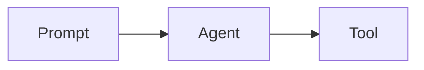
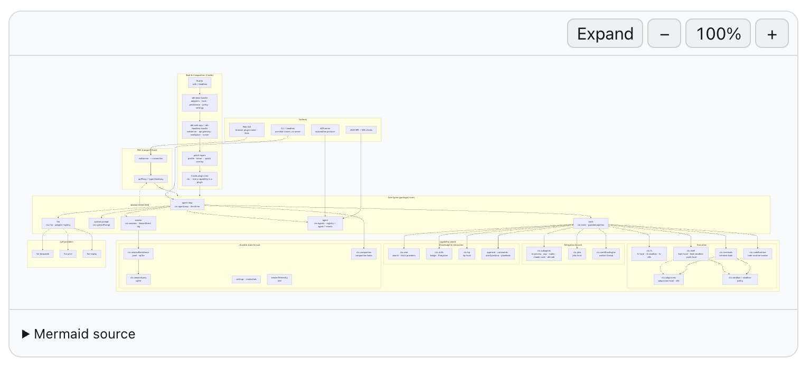
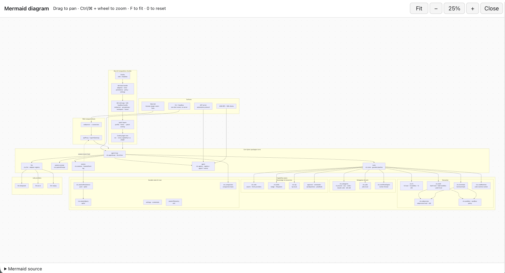

# dsh-mermaid-web

[](https://github.com/terrywangcode/dsh-mermaid-web/actions/workflows/ci.yml)
[](https://github.com/terrywangcode/dsh-mermaid-web/releases)
[](LICENSE)

An out-of-tree DeepSeek Harness Web UI plugin that turns settled fenced code blocks labeled `mermaid` into Mermaid.js SVG diagrams.

````markdown

````

### Inline diagram



### Fullscreen workspace



## Install

From a DeepSeek Harness checkout:

```sh
pnpm dsh plugin --profile web add github:terrywangcode/dsh-mermaid-web
pnpm dsh --profile web web
```

The repository commits its built browser bundle, so installing from GitHub does not require a consumer-side plugin build.

To install a specific release:

```sh
pnpm dsh plugin --profile web add github:terrywangcode/dsh-mermaid-web#v0.1.0
```

## Build from source

Use Node 22 or newer:

```sh
pnpm install
pnpm run build
cd ../deepseek-harness
pnpm dsh plugin --profile web add ../dsh-mermaid-web
pnpm dsh --profile web web
```

The package is a bundle: `cordis.patch.yml` inserts its host row, while `dsh.client` points Harness at the built `lib/client.js` browser entry.

## How it works

The package has two DSH plugin faces. `index.js` is an intentionally empty host-side Cordis entry used for Loader governance and client discovery. The `./client` export contains the browser implementation. DSH hashes and serves that bundle through `/plugins`, adds it to `window.__DSH_BOOT__`, and mounts its exported `apply(ctx)` through the browser Cordis Loader.

The browser plugin observes settled `.md-code-block` elements, renders exact `mermaid` fences with Mermaid.js, and records every DOM mutation it owns. Its Cordis effect disposer disconnects observation, closes any fullscreen workspace, removes generated UI and styles, and restores the original Harness code blocks. Client-plugin HMR therefore replaces the plugin without leaving duplicate diagrams or listeners behind.

## Runtime behavior

- Only code blocks whose settled language banner is exactly `mermaid` are enhanced.
- Blocks under `[data-streaming]` remain ordinary source until the assistant response settles.
- Mermaid runs with `securityLevel: 'strict'` and HTML flowchart labels disabled.
- Every rendered diagram has keyboard-accessible zoom out, reset, and zoom in controls. Zoom is independent per chart, advances in 25% steps, and is bounded from 50% to 300%; standards-based SVG transforms resize a matching layout stage so enlarged charts scroll inside their canvas across browsers.
- `Expand` opens a full-viewport native dialog without rerendering or duplicating the SVG. The workspace supports fit-to-screen, pointer-centered Ctrl/Command-wheel zoom, wheel/trackpad panning, drag-to-pan, 100% reset, `F`/`0`/`+`/`-` shortcuts, Escape-to-close, and a collapsible source panel. Closing or disposing the plugin returns the same SVG to its inline stage and restores its prior inline zoom.
- The original Harness code block remains in the DOM but is hidden after a successful render. The diagram includes a source disclosure for auditing.
- Parse failures leave the original source visible and append a compact error message.
- Cordis disposal/HMR disconnects the observer, removes generated diagrams and styles, and restores every hidden original block.

## Compatibility limitation

Harness currently exposes no Markdown-fence renderer slot. This plugin therefore recognizes the stable `.md-code-block` wrapper and the current `CodeBlock` child layout. A future Web UI refactor may require updating `blockLanguage()` or `blockSource()`. A first-class Markdown code-renderer slot in Harness would remove this DOM coupling.

Version `0.1.0` was verified against DeepSeek Harness `0.1.0-rc.5` at commit `47f943859b`.

## Development and security

See [CONTRIBUTING.md](CONTRIBUTING.md) for the build and live browser verification workflow. Please report suspected vulnerabilities through GitHub private vulnerability reporting as described in [SECURITY.md](SECURITY.md).

## License

MIT
